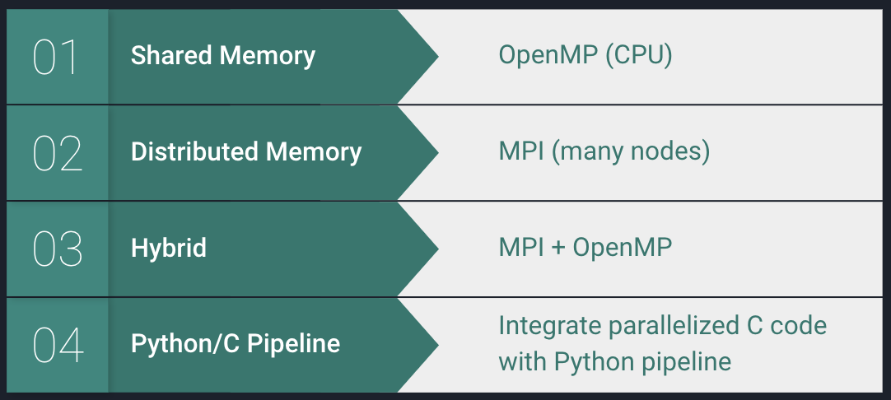

# Flattening the Curve: A Simulation Study of the Spread of COVID-19
### Jingyi Chen, Genevieve Lyons, Rebecca Youngerman, Huahua Zheng
### Harvard T.H. Chan School of Public Health

Note: This is a toy simulation of the spread of an infectious disease, and is not intended to represent any particular geographic location or use parameters that are scientifically accurate for COVID-19.

## Introduction

### Background

The purpose of this simulation is to analyze the spread of infectious diseases such as COVID-19 to better understand the way that social distancing may slow the spread for various cities in the United States.

COVID-19 is a respiratory illness that spreads from person to person. Transmission occurs through respiratory droplets, and spread is more likely when people are in close contact with one another. In March, the US government issued a number of social distancing policies and guidelines. These guidelines encourage us to avoid mass gatherings, stay in our homes, and only leave for essential needs. The purpose of these guidelines is to ensure that our healthcare system is not burdened beyond its capacity.

Through this simulation study, we seek to understand how these measures may help to combat the spread of an infectious disease such as this one. 

### SIR Model with a Simple Spatial Network

The simulation uses a standard SIR model with a simple spatial network. The SIR model is a simple compartmental epidemiological model with three main elements:

**Susceptible (S)**, where the individual has not yet been infected, and has no immunity.

**Infected (I)**, where the individual is currently infected and contagious to Susceptible neighbors.

**Removed (R)**, where the removal from further participation in the process is assumed to be permanent, due to death.

*Source: Maharaj, S., Kleczkowski, A. Controlling epidemic spread by social distancing: Do it well or not at all. BMC Public Health 12, 679 (2012).*

In our model, all individuals are initially susceptible. The pandemic is initiated by a single infected individual at a random location in the network. Each individual has a probability *p* of being infected by any individual in its infection neighborhood, calculated by the Euclidean Distance:

We assume that this probability of infection *p* is constant per time step, and each infected individual has a probability *q* to be removed from the population through death. After recovery, each individual becomes immune to the disease. The simulation is conducted over sufficient discrete time steps to run the pandemic to completion.

The social distancing function determines the behavior of each individual. A constant of 1 for each individual indicates that all individuals are moving about as normal. We will explore the effect of changing the social behavior of some individuals to simulate social distancing.

### Need for Big Compute

**Serial Implementation:** This simulation is written serially and in Python. For a population size of N = 2,000, the runtime to pandemic completion is roughly **45 minutes** (about 30 seconds per discrete time step *t*). To model a city such as New York City, where the population density is 26,000 per square mile, the problem size would grow infeasibly large.

**Time Complexity:** 

**Code Profiling:** There is a very clear bottleneck in the Euclidean Distance calculation, which is calculated between every individual in the population. This is an embarrassingly parallel problem where each individual distance may be calculated independently of one another. 

The parallelizable fraction of the existing code is **92%**.

### Design

To fully exploit powerful parallelism techniques for Big Compute, we calculate the Euclidean Distance portion of the code in C. The rest of the simulation is in Python however, so we create a Python/C pipeline by which we run the simulation through Python, but the Euclidean Distance calculation is exported to parallelized C code. 

As such, our experiments will focus on the results of parallelizing **only the subsection of the code which is in C**. We will also run some experiments on the Python/C pipeline.

Here is a snippet of the C code that will be parallelized in subsequent sections:

We will demonstrate parallelization using a hybrid system of shared and distributed memory.

## Replicability Information 

### Amazon Web Services Instance

Create a Multi-Node Cluster on AWS using a t2.2xlarge AWS Ubuntu 16.04 instance. Follow the instructions found in [Infrastructure Guide 7: MPI on AWS](https://harvard-iacs.github.io/2020-CS205/lab/I7/guide/Guide_I7.pdf). 

Upload all files found in the `code` folder in this repository. The C code `euclidean.c`, `euclidean_omp.c`, `euclidean_mpi.c`, and `euclidean_mpi_omp.c` take argument of N members of the population. 

**Instance Specs:**

### Running the Euclidean Distance Code: Serial Implementation

First, increase the user limit:
`ulimit -s unlimited`

Compile the serial code:
`gcc -DUSE_CLOCK euclidean.c -lm -o euclidean`

Run the code, including the members of the population (e.g., N = 100):
`./euclidean 100`

The elapsed time will be printed after the results.

### Running the Euclidean Distance Code: OpenMP Implementation

First, increase the user limit:
`ulimit -s unlimited`

Compile the code:
`gcc -DUSE_CLOCK -fopenmp euclidean_omp.c timing.c -lm -o eud_omp`

Set the number of threads (e.g., 8):
`export OMP_NUM_THREADS=8`

Run the code, including the members of the population (e.g., N = 100):
`./eud_omp 100`

### Running the Euclidean Distance Code: MPI Implementation

First, ensure that both your master and node have been created and are running. Also be sure that your cloud is mounted as detailed in [Infrastructure Guide 7: MPI on AWS](https://harvard-iacs.github.io/2020-CS205/lab/I7/guide/Guide_I7.pdf). 

Enter the the `mpiuser` that you created:
`su - mpiuser`

In `mpiuser@master`:

First, increase the user limit:
`ulimit -s unlimited`

Export the ports so the master and node can communicate:

`export MPICH_PORT_RANGE=10000:10100`

`export MPIR_CVAR_CH3_PORT_RANGE=10000:10100`

Compile the code on mpiuser@master:
`mpicc -DUSE_CLOCK euclidean_mpi.c -lm -o euclidean_mpi`

Move it to the cloud folder: 
`cp euclidean_mpi cloud && cd cloud`

Run the code, including the members of the population (e.g., N = 100) and the number of processes (e.g., 4):
`mpirun -np 4 -hosts master,node1 ./euclidean_mpi 100`

### Running the Euclidean Distance Code: MPI+OpenMP Hybrid Implementation

First, ensure that both your master and node have been created and are running. Also be sure that your cloud is mounted as detailed in [Infrastructure Guide 7: MPI on AWS](https://harvard-iacs.github.io/2020-CS205/lab/I7/guide/Guide_I7.pdf). 

Enter the the `mpiuser` that you created:
`su - mpiuser`

In `mpiuser@master`:

First, increase the user limit:
`ulimit -s unlimited`

Export the ports so the master and node can communicate:

`export MPICH_PORT_RANGE=10000:10100`

`export MPIR_CVAR_CH3_PORT_RANGE=10000:10100`

Compile the code on mpiuser@master:
`mpicc -DUSE_CLOCK -fopenmp euclidean_mpi_omp.c timing.c -lm -o eud_mpi_omp`

Move it to the cloud folder: 
`cp eud_mpi_omp cloud && cd cloud`

Run the code, including the members of the population (e.g., N = 100), the number of processes (e.g., 4), and the number of threads (e.g., 2):
`mpirun -np 4 -hosts master,node1 -genv OMP_NUM_THREADS 2 ./eud_mpi_omp 100`

### Python/C pipeline

First, increase the user limit:
`ulimit -s unlimited`

Compile the code：

`gcc -fPIC -c euclidean_IO.c`  
`gcc -shared -o euclidean_IO.so euclidean_IO.o`

Update any desired parameters or variable in the python simulation script. Run the simulation script, calling the C code from Python:
`python simulation.py`

## Experiments

## Simulation Results

## Conclusions and Recommendations

## References

We were inspired by the Washington Post article, [**"Why outbreaks like coronavirus spread exponentially, and how to “flatten the curve”**](https://www.washingtonpost.com/graphics/2020/world/corona-simulator/) by Harry Stevens. 

We also reference the work of [Philip Mocz](https://github.com/pmocz/coronavirusToySimulation) when building our simulation.
